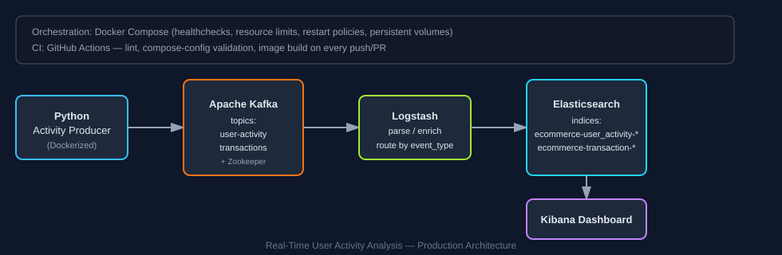

# Real-Time User Activity Analysis

Production-grade streaming analytics pipeline for e-commerce user behavior: a containerized Kafka producer streams clickstream and transaction events through a Kafka → Logstash → Elasticsearch → Kibana pipeline, fully orchestrated with Docker Compose health checks, restart policies, and CI validation.



## Stack

| Layer | Technology |
|---|---|
| Event generation | Python 3.11, `kafka-python`, `Faker` (Dockerized service) |
| Message broker | Apache Kafka + Zookeeper (Confluent images) |
| Stream processing / routing | Logstash (Kafka input → parse/enrich → Elasticsearch output) |
| Storage / search | Elasticsearch |
| Visualization | Kibana |
| Orchestration | Docker Compose (healthchecks, resource limits, named volumes, restart policies) |
| CI | GitHub Actions (lint, compose validation, image build) |

## Architecture

```
Producer (Docker) --> Kafka (user-activity, transactions)
                          --> Logstash (enrich: event_type, real @timestamp)
                              --> Elasticsearch (ecommerce-<event_type>-YYYY.MM.dd)
                                  --> Kibana dashboards
```

## Quick Start

```bash
git clone https://github.com/Vaibhavkoneti/Real_Time_User_Activity_Analysis.git
cd Real_Time_User_Activity_Analysis
docker compose up -d --build
```

- Kibana: http://localhost:5601
- Elasticsearch: http://localhost:9200
- Kafka broker: localhost:9092

Tune producer load via `docker-compose.yml` environment variables on the `producer` service: `EVENTS_PER_SECOND`, `TRANSACTION_RATE`.

## Production hardening applied

- **Containerized producer** with non-root user, env-driven config, graceful SIGTERM/SIGINT shutdown (flushes in-flight messages), retry/backoff on the Kafka client, and structured logging with periodic throughput stats.
- **Docker Compose healthchecks** for every service (Zookeeper, Kafka, Elasticsearch, Logstash, Kibana) with `depends_on: condition: service_healthy` so dependents never start against a broker that isn't ready, plus `restart: unless-stopped` and memory limits on JVM services.
- **Fixed a real data-correctness bug**: the original producer used `Faker.iso8601()` (random historical dates) as the event timestamp, and Logstash mapped that fake date into `@timestamp`. That fanned a single day of test traffic out into 480+ daily Elasticsearch indices. Replaced with real UTC timestamps — collapses to one index per actual day.
- **Named volumes** for Kafka, Zookeeper, and Elasticsearch so state survives container restarts.
- **CI pipeline** (`.github/workflows/ci.yml`) lints the producer, validates the Compose file, and builds the producer image on every push/PR.
- **Load test script** (`scripts/load_test.py`) for repeatable throughput/latency measurement against the live stack.

## Measured results (local 4-core/16GB Docker Desktop host)

Captured with `python scripts/load_test.py` (2,000 messages) against the full stack with the background producer also running at 10 events/sec:

| Metric | Result |
|---|---|
| Producer throughput | ~4,000–7,800 msgs/sec (burst) |
| End-to-end ingest latency (p50) | ~315–455 ms |
| End-to-end ingest latency (p95) | ~335–520 ms |
| Steady-state producer rate | 10 events/sec, 0 errors over sustained run |
| Elasticsearch indices after fix | 1 index/day per event type (was 480+ before the timestamp fix) |

Full run log: [`docs/results.md`](docs/results.md).

## Repo layout

```
producer/                Dockerized Kafka producer (app.py, Dockerfile, requirements.txt)
logstash/pipeline/        Logstash pipeline config
scripts/load_test.py       Throughput/latency load-testing tool
docs/architecture.svg      Architecture diagram
docs/results.md             Captured load-test output
.github/workflows/ci.yml    CI: lint, compose validation, image build
docker-compose.yml          Full stack orchestration
```
